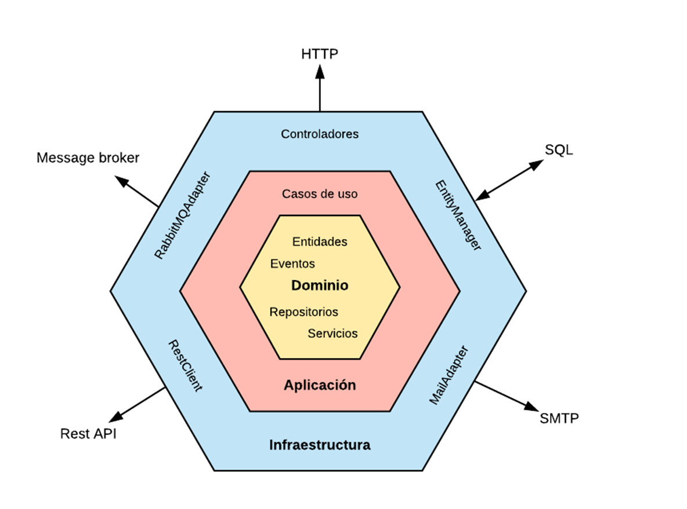

# Arquitectura Hexagonal

### ¿Qué es la Arq. Hexagonal?
- Permite separar la lógica de negocios del resto de la implementación (frameworks, etc)
- Promueve la separación de asuntos mediante la encapsulación de la lógica en diferentes capas de la aplicación.
-Es una implementación de la llamada Arq. Limpia (Clean Architecture)
- Se la conoce también como arq. de puertos y adaptadores o arq. cebolla.

### Objetivo
El objetivo de usar una arquitectura limpia es tener sistemas:
- Independientes del framework.
- Testables.
- Independientes de la UI.
- Independientes de la base de datos.
- Independiente de agentes externos.
- Más tolerantes al cambio.
- Reutilizables.
- Mantenibles.

### Esquema



### Ejercicio de ejemplo
Dado una implementación en un seudo framework tipo Django, que contiene un modelo Package, 
con campos con sus dimensiones, realizar un seudo endpoint que calcule el volumen de todos los 
paquetes que estén en la base de datos.
La respuesta de dicho endpoind será una lista cuyos elementos tengan el id del paquete, 
el volumen del mismo y un campo que indique el tipo de error.
Si el cálculo de volumen presenta algún error, el parametro volumen será None. En caso contrario el 
parámetro error será None.

### Estructura de ejemplo

```
app
├───adapter (Infrastructure)
│   ├───logic (Use Cases)
│   │   └───package
│   └───repositories
│       └───package
├───domain
│   └───package
│       └───tests
└───seudo_django (Framework)
```
